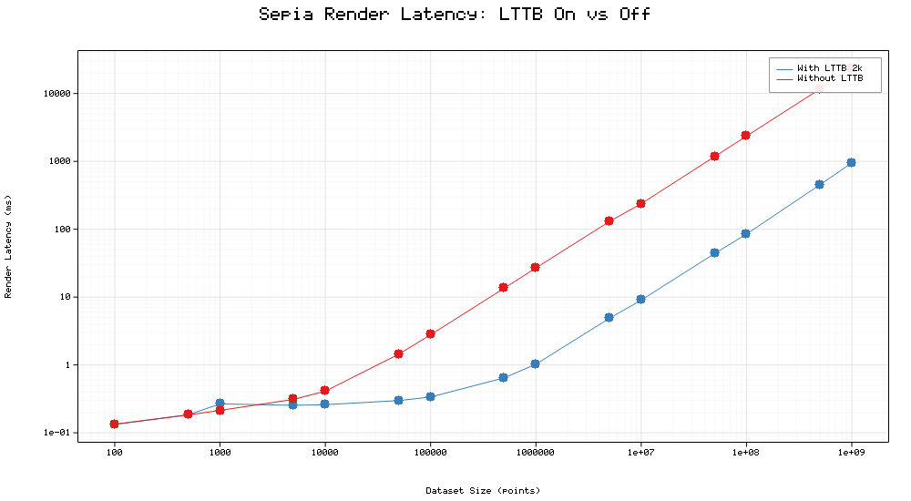

# Sepia

A native C++17 plotting framework for publication-quality 2D visualizations. Zero external dependencies — just the standard library.

Handles datasets from a few points to **tens of millions** through built-in LTTB (Largest-Triangle-Three-Buckets) decimation.

## Features

- 2D line plots with multiple series, colors, line styles, markers, and fill
- Automatic axis generation with "nice" tick marks and grid rendering
- Built-in 5x7 bitmap font — no FreeType or external font libraries
- Xiaolin Wu anti-aliased line drawing
- LTTB Level-of-Detail decimation for mega-datasets
- Cache-line aligned memory buffers (SIMD-friendly)
- PPM image output — no libpng, no external image libraries
- Header-mostly architecture — single `.cpp` file to compile

## Project Structure

```
Sepia/
├── include/sepia/
│   ├── sepia.hpp              # Single umbrella header
│   ├── core/
│   │   ├── types.hpp          # Type aliases, Color, BBox, Rect, enums
│   │   └── memory.hpp         # AlignedBuffer, Arena (bump allocator)
│   ├── data/
│   │   └── series.hpp         # DataView, Series, ExternalSeries, LttbDecimator
│   ├── params/
│   │   └── params.hpp         # DataStyle, GridStyle, AxisStyle, LegendStyle, etc.
│   ├── plot2d/
│   │   ├── figure.hpp         # Figure class (main user-facing API)
│   │   ├── plot_command.hpp   # PlotCommand fluent builder
│   │   └── plot_entry.hpp     # PlotEntry (data + style storage)
│   ├── rendering/
│   │   ├── canvas.hpp         # Canvas (RGBA pixel buffer + drawing primitives)
│   │   ├── text.hpp           # Bitmap font and text rendering
│   │   ├── transform.hpp      # CoordTransform (data-space ↔ pixel-space)
│   │   └── tick_engine.hpp    # TickEngine (axis tick computation)
│   └── output/
│       └── ppm_writer.hpp     # PPM file export
├── src/plot2d/
│   └── figure.cpp             # Minimal compiled source (~20 lines)
├── examples/
│   ├── basic.cpp              # Simple sine wave
│   ├── multi_plot.cpp         # Multiple curves with styles
│   └── large_dataset.cpp      # 10M points with LTTB demo
└── stress/
    └── stresstest.cpp         # Benchmark: latency across dataset sizes ± LTTB
```

## Download

```bash
git clone https://github.com/MoonFlowww/Sepia.git
cd Sepia
```

## Building

Sepia is header-mostly. You only need to compile `src/plot2d/figure.cpp` alongside your own source files.

### Build an example

```bash
mkdir -p build
g++ -std=c++17 -O2 -I include examples/basic.cpp src/plot2d/figure.cpp -o build/basic
./build/basic   # produces basic.ppm
```

### Build the stress test

```bash
g++ -std=c++17 -O2 -I include stress/stresstest.cpp src/plot2d/figure.cpp -o build/stresstest
./build/stresstest   # produces stresstest_results.ppm
```

### Integrate into your project

Add the `include/` directory to your include path and compile `src/plot2d/figure.cpp` with your build. No other dependencies needed.

```cmake
# CMake example
add_library(sepia STATIC src/plot2d/figure.cpp)
target_include_directories(sepia PUBLIC include)
target_compile_features(sepia PUBLIC cxx_std_17)
```

## Quick Start

```cpp
#include "sepia/sepia.hpp"
#include <cmath>
#include <vector>

int main() {
  const size_t N = 200;
  std::vector<sepia::f64> x(N), y(N);
  for (size_t i = 0; i < N; ++i) {
    x[i] = static_cast<double>(i) * 0.05;
    y[i] = std::sin(x[i]);
  }

  Sepia::plot2d::Figure figure(700.0, 450.0);
  figure.set_title("Sine Wave");
  figure.set_xlabel("Time");
  figure.set_ylabel("Amplitude");

  figure.plot(x.data(), y.data(), N)
    .data({.color = sepia::Color::blue(), .width = 2.0, .label = "sin(x)"});

  figure.grid({.show = true, .major_color = {210, 210, 210}});

  figure.render();
  figure.save_ppm("basic.ppm");
  return 0;
}
```

## API Reference

### Figure

The central user-facing class. Create one, configure it, plot data, render, and save.

```cpp
Sepia::plot2d::Figure figure(width, height);   // dimensions in pixels

// Titles and labels
figure.set_title("My Plot");
figure.set_xlabel("X Axis");
figure.set_ylabel("Y Axis");

// Style configuration (all use aggregate initialization)
figure.grid({.show = true, .show_minor = true});
figure.axis({.show = true, .tick_size = 5.0});
figure.legend({.show = true, .position = "top-right"});
figure.layout({.margin_left = 80.0, .background = sepia::Color::white()});
figure.text({.color = sepia::Color::black(), .font_size = 12.0});
figure.perf({.lod_enable = true, .lod_target_points = 2000});


// Render and export
figure.render();
figure.save_ppm("output.ppm");
```

### Plotting Data

Three ways to add data to a figure:

```cpp
// 1. Owning (copies data into aligned storage)
figure.plot(x_ptr, y_ptr, count)
  .data({.color = sepia::Color::red(), .width = 2.0, .label = "my curve"});

// 2. Owning (move a pre-built Series)
figure.plot(sepia::data::Series(std::move(x_buf), std::move(y_buf)))
  .data({.color = sepia::Color::blue()});

// 3. Non-owning (zero-copy reference to your memory)
figure.plot_ref(x_ptr, y_ptr, count)
  .data({.color = sepia::Color::green()});
```

### PlotCommand (Fluent Builder)

`figure.plot(...)` returns a `PlotCommand` that supports chaining:

```cpp
figure.plot(x, y, n)
  .color(sepia::Color::orange())
  .width(2.5)
  .alpha(0.8)
  .label("signal")
  .line(sepia::LineStyle::Dashed)
  .marker(sepia::MarkerStyle::Circle, 3.0)
  .fill(true, sepia::Color::orange().with_alpha(50));
```

Or pass everything at once via `DataStyle`:

```cpp
figure.plot(x, y, n)
  .data({
    .color      = sepia::Color::red(),
    .width      = 1.5,
    .alpha      = 0.9,
    .line_style = sepia::LineStyle::Solid,
    .marker     = sepia::MarkerStyle::Circle,
.marker_size = 4.0,
    .fill       = false,
    .label      = "my data"
  });
```

### Style Structs

| Struct | Key fields |
|--------|-----------|
| `DataStyle` | `color`, `width`, `alpha`, `line_style`, `marker`, `marker_size`, `fill`, `fill_color`, `label` |
| `GridStyle` | `show`, `major_color`, `minor_color`, `major_width`, `minor_width`, `show_minor` |
| `AxisStyle` | `show`, `color`, `width`, `tick_size`, `x_min/x_max/y_min/y_max` (-1=no default) |
| `LegendStyle` | `show`, `bg_color`, `border`, `padding`, `position` |
| `LayoutStyle` | `margin_top/bottom/left/right`, `background` |
| `TextStyle` | `color`, `font_size`, `font_face` |
| `PerfParams` | `lod_enable`, `lod_target_points` |

### Colors

Built-in presets:

```cpp
sepia::Color::black()    sepia::Color::white()
sepia::Color::red()      sepia::Color::blue()
sepia::Color::green()    sepia::Color::orange()
sepia::Color::purple()   sepia::Color::gray()

// Custom
sepia::Color(r, g, b);             // opaque
sepia::Color(r, g, b, a);          // with alpha
color.with_alpha(128);             // semi-transparent variant
```

### Line Styles & Markers

```
LineStyle:   Solid, Dashed, Dotted, DashDot, None
MarkerStyle: None, Circle, Square, Triangle, Cross, Diamond
```

## Data Ownership

Sepia offers three ownership models depending on your performance and lifetime needs:

| Method | Ownership | Copy? | When to use |
|--------|-----------|-------|-------------|
| `figure.plot(ptr, ptr, n)` | **Figure owns** | Yes — data is copied into cache-aligned `AlignedBuffer` | Default. Safe after your arrays go out of scope. |
| `figure.plot(Series&&)` | **Figure owns** | No — moved in | You already have a `Series` or `AlignedBuffer`. Zero-copy transfer. |
| `figure.plot_ref(ptr, ptr, n)` | **You own** | No — zero-copy view | Performance-critical. **You must keep your arrays alive** until after `render()`. |

### AlignedBuffer

`sepia::AlignedBuffer<T>` is a cache-line aligned (64-byte) contiguous buffer. Used internally for all owned data. SIMD-friendly.

```cpp
sepia::AlignedBuffer<sepia::f64> x(N), y(N);
// Fill x, y...
auto series = sepia::data::Series(std::move(x), std::move(y));
figure.plot(std::move(series));
```

### LTTB Decimation (Level-of-Detail)

When `enable_lod` is `true` (the default) automatically downsampled to `lod_target_points` using the **Largest-Triangle-Three-Buckets** algorithm before rendering. This preserves visual shape while keeping render times constant regardless of input size.

```cpp
// Defaults (in PerfParams):
//   lod_enable        = true
//   lod_target_points = 2000

// Custom tuning
figure.perf({.lod_enable = true, .lod_target_points = 5000});

// Disable decimation entirely
figure.perf({.enable_lod = false});
```

The decimation is transparent — it happens during `render()` and does not modify your original data.

## Output Format

Sepia outputs **PPM (Portable Pixmap)** files. To convert to PNG:


```bash
# Using ImageMagick
convert output.ppm output.png

# Using ffmpeg
ffmpeg -i output.ppm output.png
```

## Requirements

- C++17 compiler (GCC 7+, Clang 5+, MSVC 2017+)
- No external libraries

## Stress Test Results
```
g++ -std=c++20 -O3 -march=native stress/stresstest.cpp src/plot2d/figure.cpp
```

```
[cmd] time ./a.out

󰣇 codebase/cpp/Sepia   main  ✘!? ❯ time ./a.out                                                                                                                                                                           13:34 
Dataset Size     With LTTB[2k] (ms)  Without LTTB (ms)
------------     ------------------  -----------------
100                         0.13             0.13
500                         0.18             0.18
1000                        0.27             0.21
5000                        0.25             0.31
10000                       0.26             0.41
50000                       0.30             1.45
100000                      0.34             2.79
500000                      0.65            13.52
1000000                     1.03            26.90
5000000                     4.88           130.21
10000000                    9.02           237.77
50000000                   44.08          1181.51
100000000                  84.93          2358.79
500000000                 453.79         11706.21
1000000000                952.29         23490.69

Results plotted to stresstest_results.ppm

--- Summary ---
At 1T points:
  With LTTB[2k]:  952.29 ms
  Without LTTB:   23490.69 ms
  Speedup:        24.7x
./a.out  169,84s user 2,19s system 99% cpu 2:52,21 total
```


